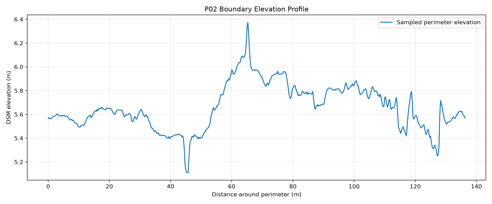
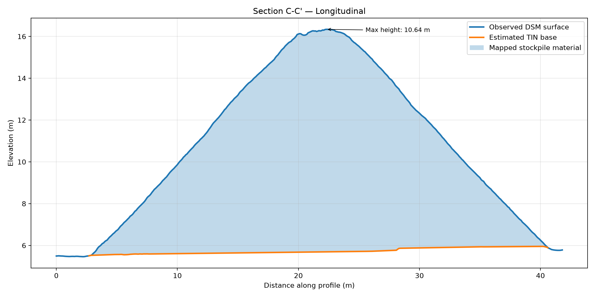
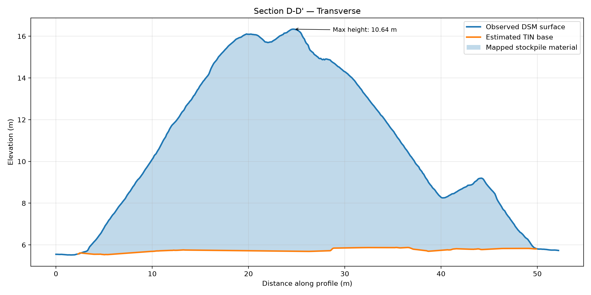

# Stockpile Volume and Cross-Section Analysis

A QGIS and Python workflow for estimating stockpile volume from a public orthomosaic and digital surface model (DSM), with two contrasting stockpile cases:

- **P01:** a small aggregate pile contained by retaining walls, modeled with a least-squares sloping floor plane.
- **P02:** a large freestanding aggregate pile, modeled with a cleaned perimeter-based triangulated irregular network (TIN).

The project demonstrates stockpile-boundary interpretation, local base-surface reconstruction, raster subtraction, volume integration, cross-section extraction, and sensitivity testing for alternative modeling assumptions.

> **Demonstration project:** This is a portfolio analysis using public sample data. It is not a certified survey, inventory report, or commercial deliverable.

## Results overview

| Pile | Primary base model | Footprint area | Mean positive height | Maximum height | Estimated volume |
|---|---|---:|---:|---:|---:|
| P01 | Least-squares sloping plane | 75.70 m² | 1.59 m | 2.89 m | 120.55 m³ / 157.67 yd³ |
| P02 | Cleaned perimeter TIN | 1,207.32 m² | 3.67 m | 10.74 m | 4,412.86 m³ / 5,771.80 yd³ |

## P01 — Contained stockpile


### Primary estimate

| Metric | Result |
|---|---:|
| Footprint area | 75.70 m² |
| Mean positive height | 1.59 m |
| Maximum height | 2.89 m |
| Estimated volume | 120.55 m³ |
| Estimated volume | 157.67 yd³ |

The primary P01 result uses a least-squares sloping plane fitted from six exposed-floor samples around the stockpile bay.

### P01 cross-sections

#### Section A–A′ — Longitudinal


The longitudinal section runs from the open toe toward the rear wall contact. It shows a gradual rise to the highest part of the pile and a longer descending slope toward the contained end of the bay.

#### Section B–B′ — Transverse


The transverse section crosses the broad upper portion of the stockpile from a wall-contact side toward the open-side toe. The estimated floor rises gently across the section.

### P01 method

1. A custom stockpile-footprint polygon was digitized while excluding retaining walls and obvious surrounding floor.
2. Six exposed-floor sample polygons were drawn around the bay entrance.
3. Zonal statistics were calculated for each sample area.
4. A least-squares plane was fitted to the sample centroids and mean elevations:

```text
z = (0.020881284358 × x) + (-0.004845953072 × y) - 324.947153669248
```

The fitted plane had an RMSE of approximately **0.027 m**.

5. The floor plane was evaluated across the DSM grid.
6. Height above floor was calculated as:

```text
height above floor = DSM − estimated floor plane
```

7. Small negative values were clamped to zero before volume integration.
8. Volume was calculated from the 0.02 m DSM pixels:

```text
volume = sum of positive pixel heights × 0.0004 m²
```

### P01 sensitivity checks

| Scenario | Footprint area | Volume | Difference from primary |
|---|---:|---:|---:|
| Sloping floor + custom boundary | 75.70 m² | 120.55 m³ | — |
| Constant floor + custom boundary | 75.70 m² | 112.20 m³ | −6.93% |
| Sloping floor + supplied perimeter | 73.44 m² | 117.86 m³ | −2.23% |

The constant-floor comparison showed that base-surface reconstruction had a larger effect than the supplied-versus-custom boundary comparison for P01.

## P02 — Freestanding stockpile


P02 extends the workflow to a much larger freestanding pile and tests whether a perimeter-based TIN can provide a more locally responsive buried-base model than a single fitted plane.

### Primary estimate

| Metric | Result |
|---|---:|
| Footprint area | 1,207.32 m² |
| Positive-area coverage | 1,202.26 m² |
| Mean positive height | 3.67 m |
| Maximum height | 10.74 m |
| Estimated volume | 4,412.86 m³ |
| Estimated volume | 5,771.80 yd³ |

### Boundary controls and anomaly review

The P02 perimeter was sampled every 0.25 m, producing 546 DSM-elevation samples. The perimeter profile was reviewed against the orthophoto and hillshade before interpolation.

Most local elevation changes were retained because they corresponded to real yard or toe conditions, including:

- a drainage depression near the concrete platform;
- disturbed ground and heavy-equipment ruts;
- rough but continuous toe transitions;
- local moisture or material differences.

A short interval affected by an exposed chain/equipment artifact was excluded from the TIN controls. The cleaned control layer contained **533 points**.



### Perimeter-TIN base

The cleaned perimeter points were triangulated with linear interpolation and rasterized to the DSM grid inside the P02 footprint.

The resulting TIN base ranged from approximately **5.11 to 6.09 m**. Because the model is piecewise planar, triangular facets remain visible in the base raster; these are an inherent feature of the interpolation method rather than an error.

The primary P02 height model was calculated as:

```text
height above TIN = DSM − estimated perimeter TIN
```

Before clamping:

- 12,662 pixels were negative;
- negatives represented about 0.42% of valid pixels;
- the minimum residual was approximately −0.129 m.

The limited number and depth of negative residuals supported use of the perimeter TIN as the primary P02 base model.

### P02 cross-sections

#### Section C–C′ — Longitudinal



The longitudinal profile follows the main ridge direction and shows a broad crest with a maximum sampled height of approximately 10.64 m above the estimated TIN base.

#### Section D–D′ — Transverse



The transverse profile crosses the broad central body of the pile and captures both the principal crest and a smaller secondary lobe.

### P02 fitted-plane sensitivity check

A least-squares plane was fitted to the same 533 cleaned perimeter controls:

```text
z = (-0.005861239603 × x) + (-0.004727344370 × y) + 1463.549150220370
```

The fitted plane had:

- RMSE: 0.139 m
- MAE: 0.108 m
- residual range: −0.501 m to +0.362 m

The plane produced a tighter base-elevation range of approximately **5.50 to 5.83 m**, but it did not preserve the local drainage and yard-grade variation represented by the TIN.

| P02 base model | Volume | Difference from TIN | Negative pixels | Minimum residual |
|---|---:|---:|---:|---:|
| Cleaned perimeter TIN | 4,412.86 m³ | — | 12,662 | −0.129 m |
| Least-squares plane | 4,493.58 m³ | +1.83% | 41,915 | −0.503 m |

The fitted plane increased volume by **80.72 m³** but produced substantially more and deeper negative residuals. The perimeter TIN was therefore retained as the primary P02 model, while the plane result is reported as a sensitivity case.

## Tools

- QGIS 3.44
- GDAL
- Python
- NumPy
- pandas
- Rasterio
- Matplotlib
- SciPy
- GeoPandas
- Shapely
- PyProj
- GeoPackage

## Repository structure

```text
04_stockpile_volume_analysis/
├── data/
│   ├── raw/                 # Source-data notes; large raw files are excluded from Git
│   ├── processed/           # Shared GeoPackage and derived rasters
│   └── results/             # CSV and text analysis outputs
├── exports/                 # Final maps, profiles, and diagnostic figures
├── notes/                   # Working notes
├── project/                 # QGIS project file
├── screenshots/             # Selected workflow screenshots
├── scripts/
│   ├── p01_fit_floor_plane.py
│   ├── p01_create_floor_raster.py
│   ├── p01_calculate_stockpile_volume.py
│   ├── p01_calculate_constant_floor_volume.py
│   ├── p01_calculate_supplied_boundary_volume.py
│   ├── p01_plot_cross_sections.py
│   ├── p02_plot_boundary_profile.py
│   ├── p02_build_tin_base.py
│   ├── p02_calculate_tin_volume.py
│   ├── p02_fit_plane.py
│   ├── p02_create_plane_raster.py
│   ├── p02_calculate_plane_volume.py
│   └── p02_plot_cross_sections.py
├── README.md
└── requirements.txt
```

## Reproducing the Python steps

Create and activate a virtual environment:

```bash
python3 -m venv .venv
source .venv/bin/activate
python -m pip install -r requirements.txt
```

The scripts depend on intermediate files created in QGIS, including exported control-point CSVs, GeoPackage layers, and sampled profile CSVs.

### P01 sequence

```bash
python scripts/p01_fit_floor_plane.py
python scripts/p01_create_floor_raster.py
python scripts/p01_calculate_stockpile_volume.py
python scripts/p01_calculate_constant_floor_volume.py
python scripts/p01_calculate_supplied_boundary_volume.py
python scripts/p01_plot_cross_sections.py
```

### P02 sequence

```bash
python scripts/p02_plot_boundary_profile.py
python scripts/p02_build_tin_base.py
python scripts/p02_calculate_tin_volume.py
python scripts/p02_fit_plane.py
python scripts/p02_create_plane_raster.py
python scripts/p02_calculate_plane_volume.py
python scripts/p02_plot_cross_sections.py
```

## Data source

The source data comes from the public **Stockpiles** sample dataset provided by Virtual Surveyor for practicing drone-based stockpile inventory workflows.

- Dataset page: https://support.virtual-surveyor.com/support/solutions/articles/1000310553-download-sample-datasets#Stockpiles
- Data credit listed by Virtual Surveyor: GeoID
- Source-dataset purpose: stockpile inventory demonstration

Large source rasters are not committed to this repository. See `data/raw/README.md` for acquisition and placement notes.

## Limitations

- Both buried base surfaces are inferred rather than directly observed beneath the stockpiles.
- Stockpile footprints are manually interpreted from imagery and surface shape.
- The P01 retaining-wall contacts limit observation of a natural toe on three sides.
- The P02 perimeter TIN contains visible piecewise-planar facets because it is based on boundary controls rather than interior ground observations.
- A chain/equipment artifact was excluded from the P02 base controls, but embedded equipment inside the pile footprint was not separately removed from the observed DSM and may cause a small positive bias.
- Heavy-equipment disturbance, ruts, drainage features, and localized moisture differences affect the visible perimeter surface.
- The workflow measures visible surface geometry; it does not verify material composition, density, moisture content, or commercial suitability.
- Sensitivity checks compare plausible modeling choices but do not establish absolute survey accuracy.
- No independent ground-control, check-point, or certified survey validation was available for this portfolio exercise.
