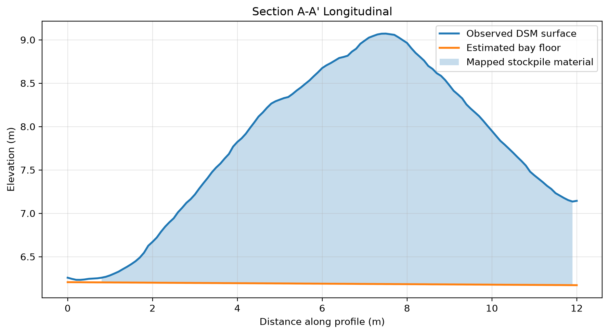
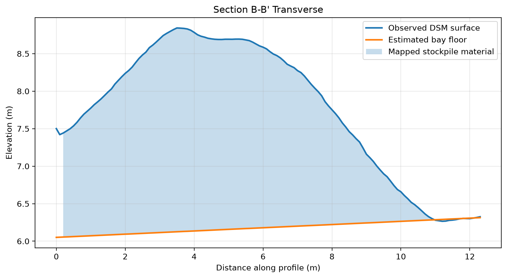

# Stockpile Volume and Cross-Section Analysis

A QGIS and Python workflow for estimating the volume of a contained aggregate stockpile from a public orthomosaic and digital surface model (DSM).

The project reconstructs an estimated bay floor from exposed ground samples, calculates stockpile height above that floor, integrates positive raster heights to estimate volume, and checks how sensitive the result is to alternative floor and boundary assumptions.

> **Demonstration project:** This is a portfolio analysis using public sample data. It is not a certified survey, inventory report, or commercial deliverable.

## Final result


### Primary estimate

| Metric | Result |
|---|---:|
| Footprint area | 75.70 m² |
| Mean positive height | 1.59 m |
| Maximum height | 2.89 m |
| Estimated volume | 120.55 m³ |
| Estimated volume | 157.67 yd³ |

The primary result uses a least-squares sloping plane fitted from six exposed-floor samples around the stockpile bay.

## Cross-sections

### Section A–A′ — Longitudinal



The longitudinal section runs from the open toe toward the rear wall contact. It shows a gradual rise to the highest part of the pile and a longer descending slope toward the contained end of the bay.

### Section B–B′ — Transverse



The transverse section crosses the broad upper portion of the stockpile from a wall-contact side toward the open-side toe. The estimated floor rises gently across the section.

## Method

### 1. Select the target stockpile

A single stockpile was chosen from the supplied Zeebrugge stockpile dataset. The selected pile is contained by retaining walls on three sides and has an exposed toe at the bay entrance.

A custom `target_stockpile_boundary` polygon was digitized to represent the visible pile footprint while excluding the retaining walls and obvious surrounding floor.

### 2. Sample the exposed bay floor

Six polygons were drawn over exposed floor near the pile. Areas with obvious spilled aggregate, wall structures, and strong tire disturbance were avoided where possible.

Zonal statistics from the DSM were calculated for each sample polygon. The sample means ranged from approximately 6.23 to 6.37 m, while within-sample standard deviations remained small. This indicated a modest spatial grade rather than one perfectly horizontal floor elevation.

### 3. Fit a sloping floor plane

Centroids were created for the six floor samples, and their projected X and Y coordinates were paired with mean DSM elevation. A least-squares plane was fitted in Python:

```text
z = (0.020881284358 × x) + (-0.004845953072 × y) - 324.947153669248
```

The plane-fit RMSE was approximately 0.027 m.

The fitted equation was evaluated across the DSM grid to create `estimated_floor_plane.tif`.

### 4. Calculate height above the estimated floor

The floor raster was subtracted from the DSM:

```text
height above floor = DSM − estimated floor plane
```

The result was clipped to the custom stockpile boundary. Small negative values near the toe were interpreted as local surface noise, boundary uncertainty, or minor mismatch in the reconstructed floor and were clamped to zero before volume integration.

### 5. Calculate volume

The DSM has a 0.02 m pixel size, giving each pixel an area of 0.0004 m².

Volume was calculated as:

```text
volume = sum of positive pixel heights × pixel area
```

This produced the primary estimate of **120.55 m³**.

### 6. Generate cross-sections

Two profile lines were digitized through the pile:

- `P01_LONG` / Section A–A′: longitudinal profile
- `P01_CROSS` / Section B–B′: transverse profile

Points were generated every 0.10 m along each line. DSM elevation, estimated floor elevation, and positive stockpile height were sampled to those points and plotted with Matplotlib.

## Sensitivity checks

The analysis compares the primary model against two alternatives while changing one assumption at a time.

| Scenario | Footprint area | Volume | Difference from primary |
|---|---:|---:|---:|
| Sloping floor + custom boundary | 75.70 m² | 120.55 m³ | — |
| Constant floor + custom boundary | 75.70 m² | 112.20 m³ | −6.93% |
| Sloping floor + supplied perimeter | 73.44 m² | 117.86 m³ | −2.23% |

### Base-surface sensitivity

A horizontal floor at the mean elevation of the six floor samples produced **112.20 m³**, approximately **6.93% lower** than the sloping-plane estimate.

The constant-floor model also produced more negative pixels before clamping and a larger negative minimum. This suggests that the sloping plane better represents the observed grade around this bay, while also showing that floor reconstruction has a meaningful influence on the volume estimate.

### Boundary sensitivity

Using the supplied Virtual Surveyor perimeter with the same sloping floor produced **117.86 m³**, approximately **2.23% lower** than the custom-boundary result.

The supplied perimeter was smoother and slightly more conservative. Its footprint area was about 2.98% smaller, while the volume difference was smaller because much of the excluded area occurred near the shallow toe.

Neither alternate model is treated as ground truth. The comparisons quantify how model choices affect the result.

## Tools

- QGIS 3.44
- GDAL
- Python
- NumPy
- pandas
- Rasterio
- Matplotlib
- GeoPackage

## Repository structure

```text
04_stockpile_volume_analysis/
├── data/
│   ├── raw/                 # Source-data notes; large raw files are not intended for Git
│   ├── processed/           # GeoPackage and derived rasters
│   └── results/             # CSV and text analysis outputs
├── exports/                 # Final map and cross-section figures
├── notes/                   # Working notes
├── project/                 # QGIS project file
├── screenshots/             # Selected workflow screenshots
├── scripts/
│   ├── fit_floor_plane.py
│   ├── create_floor_raster.py
│   ├── calculate_stockpile_volume.py
│   ├── calculate_constant_floor_volume.py
│   ├── calculate_supplied_boundary_volume.py
│   └── plot_cross_sections.py
├── README.md
└── requirements.txt
```

## Reproducing the Python steps

Create and activate a virtual environment:

```bash
python3 -m venv .venv
source .venv/bin/activate
python -m pip install -r requirements.txt
```

The scripts depend on intermediate files created in QGIS, including the exported floor-sample centroid CSV, clipped height rasters, and sampled profile CSV.

Run the Python stages from the project root:

```bash
python scripts/fit_floor_plane.py
python scripts/create_floor_raster.py
python scripts/calculate_stockpile_volume.py
python scripts/calculate_constant_floor_volume.py
python scripts/calculate_supplied_boundary_volume.py
python scripts/plot_cross_sections.py
```

## Data source

The source data comes from the public **Stockpiles** sample dataset provided by Virtual Surveyor for practicing drone-based stockpile inventory workflows.

- Dataset page: https://support.virtual-surveyor.com/support/solutions/articles/1000310553-download-sample-datasets#Stockpiles
- Data credit listed by Virtual Surveyor: GeoID
- Source dataset purpose: stockpile inventory demonstration

Large source rasters are not required to be committed to this repository. See `data/raw/README.md` for acquisition and placement notes.

## Limitations

- The reconstructed floor is inferred from six exposed-floor samples rather than direct measurements beneath the pile.
- The stockpile footprint is manually interpreted from imagery and surface shape.
- The workflow measures visible surface geometry; it does not verify material composition, density, moisture, or commercial suitability.
- Retaining-wall contacts limit the ability to observe a natural toe on all sides.
- The sensitivity checks compare plausible modeling choices but do not establish absolute survey accuracy.
- No independent ground-control, check-point, or certified survey validation was available for this portfolio exercise.

# Raw data

The raw source files for this project come from the public **Stockpiles** sample dataset published by Virtual Surveyor.

Dataset page:
https://support.virtual-surveyor.com/support/solutions/articles/1000310553-download-sample-datasets#Stockpiles

Virtual Surveyor describes the dataset as a drone-data example for executing stockpile inventory and lists GeoID as the data provider.

## Expected local placement

The analysis was developed with the source files stored beneath:

```text
data/raw/virtual_surveyor_stockpiles/Stockpiles/
```

The principal inputs are:

```text
Zeebrugge Stocks.Ii.tif   # Orthophoto / RGB imagery
Zeebrugge Stocks.Ei.tif   # Elevation raster / DSM
```

The supplied perimeter data was also imported into QGIS for the boundary-sensitivity comparison.

## Repository policy

The large downloaded source files should remain local and should not be committed to Git unless their redistribution terms and repository-size implications have been reviewed.

This README preserves:

- the source URL;
- expected local directory structure;
- key input filenames;
- enough information for another user to reacquire the public sample dataset.
