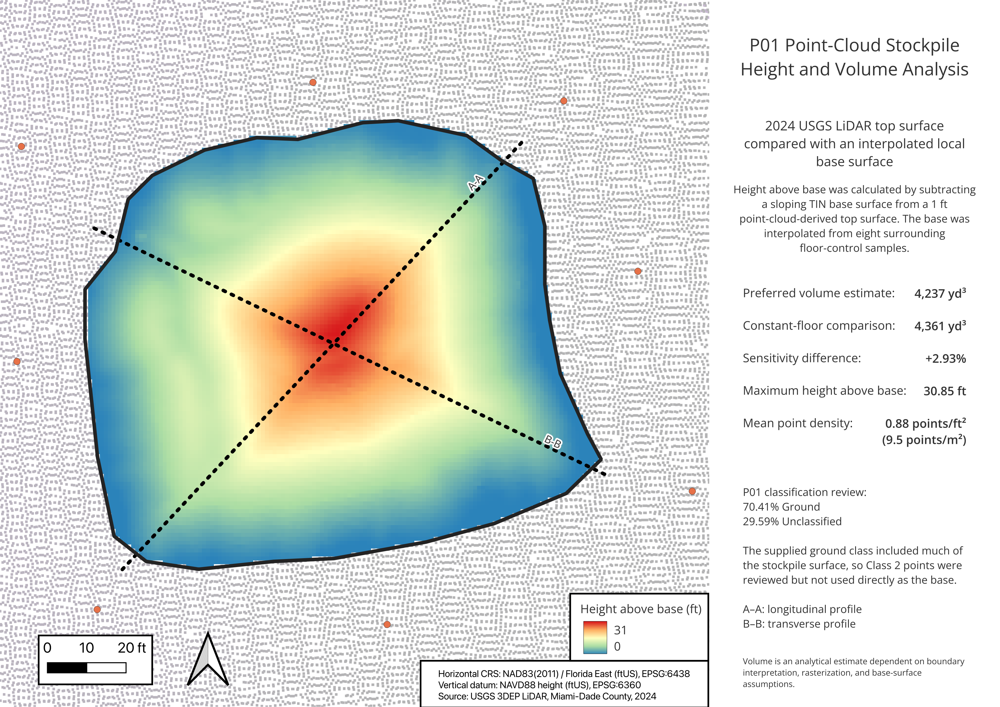
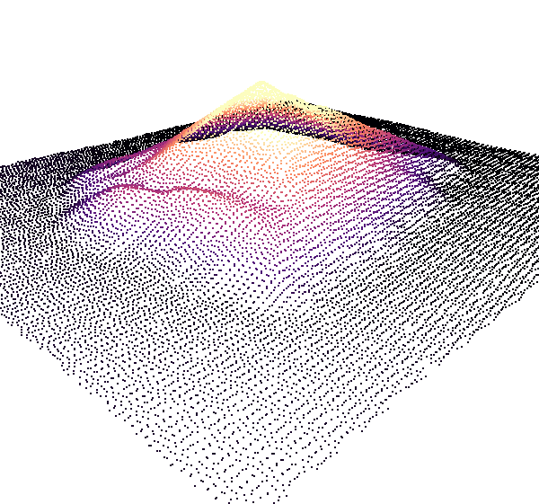
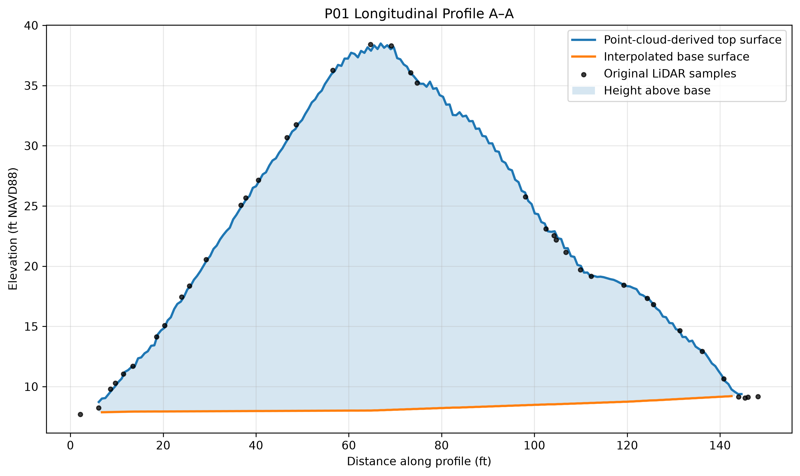
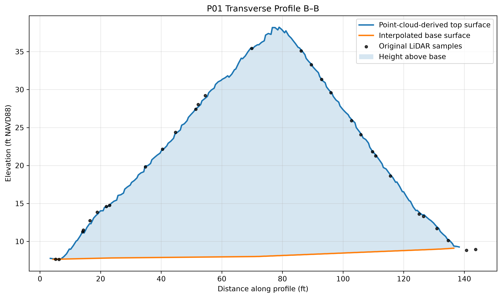

# Project 05 — Point-Cloud Stockpile and Cut/Fill Analysis

This project uses a public USGS 3DEP LAZ point cloud from an industrial site in Miami-Dade County, Florida, to estimate the volume of a free-standing stockpile.

The workflow begins with direct LAS/LAZ inspection and classification review, then builds a local base surface, rasterizes the point-cloud top surface, calculates height above base, estimates volume, and validates the result with profile plots and a sensitivity comparison.

## Final production map



## Key result

- Preferred volume estimate: **4,237 yd³**
- Constant-floor comparison: **4,361 yd³**
- Sensitivity difference: **+2.93%**
- Maximum height above base: **30.85 ft**
- Mean point density: **0.88 points/ft²** or **9.5 points/m²**

The preferred estimate uses a sloping TIN base surface derived from eight surrounding floor-control samples. A constant floor at 8.005 ft NAVD88 produced a result only 2.93% higher, suggesting that the final estimate is reasonably stable under the tested base assumption.

## Point-cloud review



The source tile contains more than 28 million points and was reviewed in both 2D and 3D. Within the selected P01 boundary, the clipped point cloud contained 10,493 points:

| Classification | Count | Percentage |
|---|---:|---:|
| Unclassified | 3,105 | 29.59% |
| Ground | 7,388 | 70.41% |

Much of the stockpile surface had been classified as ground. Because the supplied Class 2 points did not represent a reliable pre-stockpile floor, the base surface was modeled independently from surrounding floor samples.

## Profiles

### A–A longitudinal profile



### B–B transverse profile



The profile figures compare:

- the point-cloud-derived top surface;
- the interpolated base surface;
- original LiDAR samples;
- the resulting height above base.

The original LiDAR observations closely follow the rasterized top surface along both profiles, supporting the use of the aligned top raster for volume estimation.

## Workflow summary

```text
USGS 3DEP LAZ
→ CRS, attributes, returns, and classification review
→ target stockpile selection and toe delineation
→ floor-control sampling
→ sloping TIN base surface
→ point-cloud-derived top raster
→ raster alignment and NoData handling
→ height above base
→ volume calculation
→ constant-floor sensitivity comparison
→ density and classification QA
→ profile validation
→ production map and summary tables
```

## Methodology

Eight floor-control polygons were digitized around the stockpile on surrounding yard surfaces. Median elevations ranged from approximately 7.40 to 9.90 ft NAVD88 and showed a gradual west-to-east slope.

The control samples were converted to centroid points and used to generate a linear TIN base surface. The point cloud was rasterized from Z values at approximately 1 ft resolution, aligned to the base raster, and masked to the same valid-data footprint.

Height above base was calculated as:

```text
height = max(top surface - base surface, 0)
```

Volume was calculated from the raster sum and exact cell area:

```text
volume_ft3 = raster_sum × cell_area_ft2
volume_yd3 = volume_ft3 / 27
```

The preferred sloping-base result was:

- **114,403.88 ft³**
- **4,237.18 yd³**

The constant-floor result was:

- **117,753.61 ft³**
- **4,361.24 yd³**

## Point density

A clipped 1 ft point-density raster produced:

- 11,833 valid cells;
- 10,449 represented points;
- mean density of 0.883 points/ft²;
- mean density of approximately 9.50 points/m²;
- maximum density of 2 points/ft².

This density was adequate for pile-scale surface modeling and profile validation, though it remains lower than a typical close-range drone photogrammetry or site-survey point cloud.

## Deliverables

- one-page production map;
- longitudinal and transverse profile plots;
- 3D point-cloud review image;
- classification summary CSV;
- density summary CSV;
- volume comparison CSV;
- exported profile CSVs;
- reproducible Python plotting script;
- QGIS project and analysis geometry;
- workflow, methodology, and data-source documentation.

## Repository structure

```text
05_point_cloud_stockpile_analysis/
├── README.md
├── requirements.txt
├── data/
│   ├── raw/
│   ├── interim/
│   └── processed/
├── docs/
│   ├── data_source.md
│   ├── methodology.md
│   └── workflow.md
├── outputs/
│   ├── figures/
│   ├── maps/
│   ├── profiles/
│   └── tables/
├── project/
│   └── cloudcompare/
└── scripts/
    └── plot_profiles.py
```

## Data source

- Source: USGS 3D Elevation Program
- Dataset: `USGS Lidar Point Cloud FL_MiamiDade_D23 LID2024_316038_0901`
- ScienceBase record: https://www.sciencebase.gov/catalog/item/68b8e5a0d4be0247d9626f90
- Horizontal CRS: NAD83(2011) / Florida East (ftUS), EPSG:6438
- Vertical CRS: NAVD88 height (ftUS), EPSG:6360

The raw LAZ tile is excluded from version control because of its file size. The repository preserves source links, documentation, summary tables, scripts, and final figures.

## Software

- QGIS 3.44.10
- GDAL 3.12.3
- PDAL 2.9.3
- Python 3.14
- pandas
- matplotlib

## Reproducibility

Create and activate a local virtual environment:

```bash
python3 -m venv .venv
source .venv/bin/activate
python -m pip install -r requirements.txt
```

Regenerate the labeled profile figures with:

```bash
python scripts/plot_profiles.py
```

## Limitations

This is an analytical estimate, not a survey-certified quantity. Important uncertainty sources include:

- manual stockpile-toe interpretation;
- source classification quality;
- point density and acquisition geometry;
- rasterization and grid alignment;
- interpolation from eight floor-control samples;
- the assumption that the surrounding grade continues beneath the pile;
- NoData and edge handling.

The constant-floor sensitivity comparison addresses one part of this uncertainty, but it is not a complete error budget.

## Documentation

- [Detailed workflow](docs/workflow.md)
- [Methodology](docs/methodology.md)
- [Data source](docs/data_source.md)